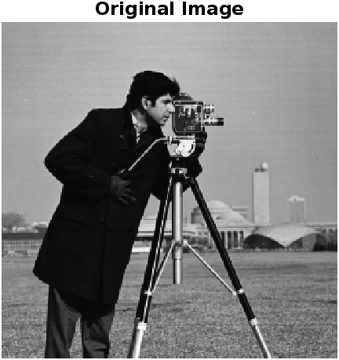
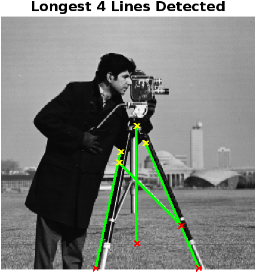
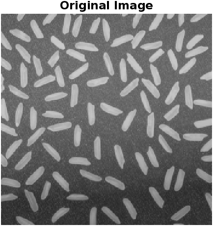
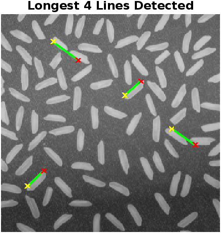

# Hough Line Detection using MATLAB

This project demonstrates **line detection using the Hough Transform** with **Canny edge detection** in MATLAB.  
It detects and visualizes the **4 longest lines** in sample images.  


---

## 📂 Repository Contents

- **ACV_ASSIGNMENT - 3.pdf** – Detailed assignment report
- **darshan_ACVassignment3.m** – MATLAB script for line detection
- **jigalachannareddy_darshan.m** – Alternative MATLAB implementation
- **Input Images:**  
  - `cameramanoriginal.png`  
  - `riceoriginal.png`  
- **Outputs:**  
  - `cameraoutput.png` – Cameraman with detected lines  
  - `riceoutput.png` – Rice image with detected lines  
  - `cameramanoutput.fig` & `riceoutput.fig` – MATLAB figure files  

---

## ⚡ Workflow

1. **Load Image** → Convert to Grayscale  
2. **Canny Edge Detection** → Extract edges  
3. **Hough Transform** → Compute accumulator array for lines  
4. **Hough Peaks** → Detect potential line segments  
5. **Draw Lines** → Visualize the **longest 4 lines** per image

---

## 🖼️ Sample Outputs

### **1. Cameraman Image**

Original | Detected Lines
:-------------------------:|:-------------------------:
 | 

---

### **2. Rice Image**

Original | Detected Lines
:-------------------------:|:-------------------------:
 | 

---

## 🚀 How to Run

1. Open MATLAB.  
2. Place all files in the same folder.  
3. Run either script:......
>>>>
```matlab  .....
